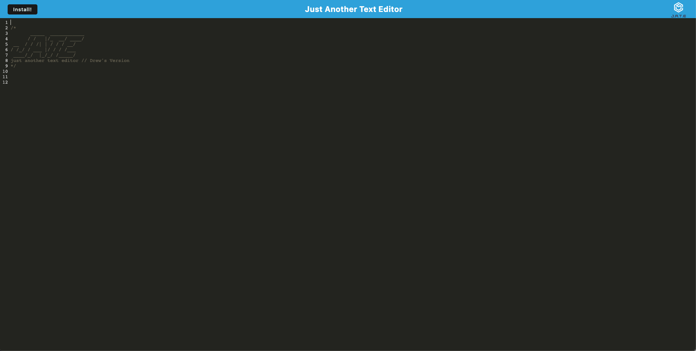

# J.A.T.E. (Just Another Text Editor)


## Table of Contents
* [Description](#description)
* [Key Features](#key-features)
* [User Story](#user-story)
* [Acceptance Criteria](#acceptance-criteria)
* [Heroku Link](#heroku-link)
* [Screenshots](#screenshots)
* [Technologies Used](#technologies-used)

## Description
Just Another Text Editor is an innovative web application aimed to offer users an intuitive and responsive text editing platform. 
The text editor can be used both online or offline. It is a progressive web application that uses IndexedDB to store data locally. 
It also uses webpack to bundle the JavaScript files and workbox to cache the application for offline use. The application can be installed on a desktop.  

### KEY FEATURES
* Offline Functionality
* Service Worker Registration
  - The application incorporates a service worker registered via Workbox. This worker is responsible for pre-caching static assets for a seamless offline user experience.
* IndexedDB
    - The application uses IndexedDB to store data locally. This allows the user to save notes or code snippets without an internet connection.
* Webpack
    - The application uses webpack to bundle the JavaScript files. This allows the user to use next-gen JavaScript in the application without errors.
* Installable Web App
    - The application can be installed on a desktop. This allows the user to access the application without having to open a browser.

## User Story
```md
AS A developer
I WANT to create notes or code snippets with or without an internet connection
SO THAT I can reliably retrieve them for later use
```

## Acceptance Criteria
```md
GIVEN a text editor web application
WHEN I open my application in my editor
THEN I should see a client server folder structure
WHEN I run `npm run start` from the root directory
THEN I find that my application should start up the backend and serve the client
WHEN I run the text editor application from my terminal
THEN I find that my JavaScript files have been bundled using webpack
WHEN I run my webpack plugins
THEN I find that I have a generated HTML file, service worker, and a manifest file
WHEN I use next-gen JavaScript in my application
THEN I find that the text editor still functions in the browser without errors
WHEN I open the text editor
THEN I find that IndexedDB has immediately created a database storage
WHEN I enter content and subsequently click off of the DOM window
THEN I find that the content in the text editor has been saved with IndexedDB
WHEN I reopen the text editor after closing it
THEN I find that the content in the text editor has been retrieved from our IndexedDB
WHEN I click on the Install button
THEN I download my web application as an icon on my desktop
WHEN I load my web application
THEN I should have a registered service worker using workbox
WHEN I register a service worker
THEN I should have my static assets pre cached upon loading along with subsequent pages and static assets
WHEN I deploy to Heroku
THEN I should have proper build scripts for a webpack application
```

## Heroku Link
https://peaceful-eyrie-84115-d8dd84774cc3.herokuapp.com/


## Screenshots


## Technologies Used
* HTML
* CSS
* JavaScript
* Heroku
* Webpack
* Workbox
